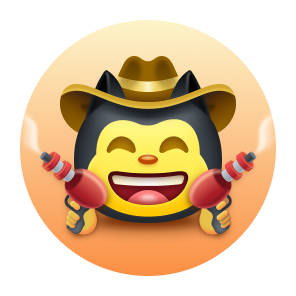
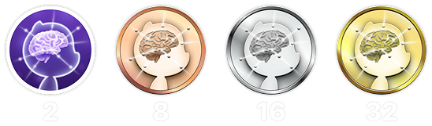
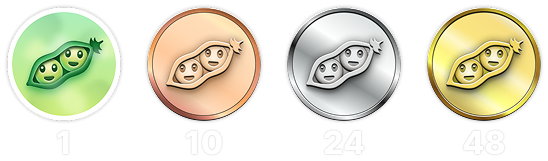
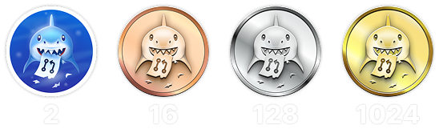
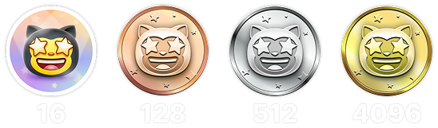

<h1 align="center">
   🏆 Hot to unlock 100% Github achievements | 2025 
   - Fair & Honest guide -
</h1>

<h3 align="center">
   Main Problem 
   Corporate GitHub ≠ Personal GitHub
</h3>

Here’s one of the biggest problems with GitHub achievements:

> Most professional developers work under corporate GitHub accounts.

That means:
- All your commits, pull requests, and reviews live on a **different organization account**
- Your **personal GitHub profile stays empty**
- And your achievements? Never unlocked.

It’s not your fault — it’s just how permissions, visibility, and access are structured in private repos.

> 💡 **Hack**  
> Sometimes, you can negotiate with your company to let you contribute from your personal GitHub account. If that’s your case — consider yourself lucky. Most devs don’t get that privilege.

<h3 align="center">Dirty Strategies</h3>

🚫 <b>Let’s talk about cheating (and why it’s dumb)</b>

Yes — there are shady ways to farm GitHub achievements: fake issues, fake PRs, spammy discussions, self-starring, ghost accounts… you name it.

> ⚠️ This guide is 100% focused on `ethical, honest and non-toxic strategies`.  
> Everything here reflects real activity and real contributions to the community.

Keep in mind:
- Achievements and contribution history are `public`.
- Anyone — recruiters, developers, teammates — can review them.
- Fake activity is painfully obvious. And embarrassing.

Achievements should reflect <strong>your real skill and value</strong>, not your ability to game the system.

> 💬 <strong>I would never hire a cheater.</strong> 
> Not because cheating is “bad”, but because cheating when there are smart, legit strategies available... is just plain stupid.

<h3 align="center">How to grind achievements the right way</h1>
Let’s talk about the real engine behind achievement growth: the fastest and most honest way to earn GitHub achievements is by doing meaningful work under your personal account — preferably in `your own open-source project`.

And no, it doesn’t have to be world-changing.

🎯 It could be:
- A resume template you’re building with a friend
- A tiny helper library of utilities you use at work
- Markdown notes from what you're learning
- A config starter or mini tool you always wished someone made

💡 The point is to create something real and keep working on it consistently.
* Commit often.
* Open pull requests.
* Start discussions.
* Improve things gradually.

Even the smallest project can become your personal growth engine.

> ⚠️ SECURITY MATTERS ⚠️  
> A `secure repo = a sustainable repo`. Protect your work.
> * Set clear access rules
> * Make sure only trusted collaborators can merge or push
> * Keep your repo clean from random spam or harmful code

<h3 align="center">Why it’s important to understand how achievements are displayed</h3>

🧠 <b>Before you grind — read this!</b>

Here’s something many people `including me` realize a bit too late:

> GitHub achievements don’t display the exact number of actions you performed.  
> They only show the <strong>current tier</strong> you’ve reached.

So when you see something like:

> <code>Pull Shark x2</code>  
> It doesn’t mean you’ve done 2 PRs.  
> It means you’ve hit the 2nd tier (for example, 32 merged PRs).

💡 That’s why you don’t need to panic or rush to create dummy PRs just to “test if it works.”

<h2 align="center">Achievements</h2>

    
<b>QUICK DRAW</b>

<blockquote>Close an issue or PR within 5 minutes of opening it.</blockquote>

    

Let’s be honest — this one’s more of a meme than a milestone 😅  
It’s so easy to get that it barely counts… but hey, it’s still a badge on your profile!

<ol>
    <li>Create a pull request</li>
    <li>Close it immediately</li>
</ol>

<blockquote>
   <b>⚠️ No need to create fake PRs. ⚠️</b> 
   Just close and reopen any real PR during normal work — it still counts.</blockquote>

    
<b>GALAXY BRAIN</b>

<blockquote>Have your reply marked as the accepted answer in a GitHub Discussion.</blockquote>

    

Galaxy Brain rewards people who give <strong>genuinely helpful answers</strong> in Discussions. If your reply is accepted by the topic starter — the badge is yours.

You can absolutely grind this achievement in your own open-source repo. This is not just legit — it’s actually a <strong>useful practice</strong> for any team.

You'll learn how to:
<ul>
    <li>Keep communication structured and easy to find</li>
    <li>Store a clear source of truth for important project decisions</li>
    <li>Keep your entire team aligned and aware of key discussions</li>
</ul>

🚀Houston, we have a problem!🚀
Even when your answer is legit and actually solves the issue — people rarely mark it as accepted. Reminders often get ignored, and you end up ghosted. Brutal, but true.

So instead of relying on strangers, try this instead:  
Grind Galaxy Brain in a **controlled environment**:  
* Team up with friends or colleagues.
* Answer their real questions
* Ask them to accept your reply if it helped.

`🧩 Strategy 1: Solve your friend problem`

<ol>
    <li>Find public repositories related to your tech stack</li>
    <li>Check if Discussions are enabled</li>
    <li>When your colleague/friend asks a question you know the answer to — help them</li>
    <li>After solving their issue, do the following:
         <ul>
            <li>Ask your colleague to help you in exchange: create a discussion in related repo with the brief you provided.
            </li>
            <li>Write your answer there</li>
            <li>Ask your friend to mark this answer as accepted</li>
         </ul>
    </li>
</ol>

✅ This approach is honest, useful, and creates long-lasting resources for the community.

`🛠️ Strategy 2: Use Discussions in your own repo`

If you maintain your own open-source project, just `move important communication into GitHub Discussions`.

1. Enable Discussions in repo settings
2. Whenever there's a decision or a feature debate — start a public thread
3. Share clear, constructive responses that help guide decisions
4. If someone else started the topic — your reply can be marked as the accepted answer

This strategy:
- Builds transparent decision history
- Shows leadership and initiative
- Helps your team stay aligned
- And yes — earns you the badge

    
<b>YOLO</b>

<blockquote>Merge a pull request without a review.</blockquote>

    

This one’s all about speed and trust — or recklessness 😅  
You only need to do it once, so here’s the cleanest way:

<ol>
    <li>Make a small, low-risk change in your project. Examples:</li>
    <ul>
        <li>Lint fix</li>
        <li>Quick one-liner patch</li>
        <li>Tiny but helpful addition to <code>README.md</code></li>
        <li>Initial commit with setup or <code>git init</code></li>
    </ul>
    <li>Open a pull request</li>
    <li>Merge it yourself without asking for a review</li>
</ol>

   <blockquote>
      ⚠️ <b>WARNING</b>⚠️ 
      Don’t YOLO in production. Just merge without review a PR with the initial commit of your open-source project😉. It’s clean, honest, and totally legit.
   </blockquote>

    
<b>PAIR EXTRAORDINAIRE</b>

<blockquote>Merge a pull request that includes a co-authored commit.</blockquote>

    

Working together makes everything better — including achievements.  
To unlock this badge, you’ll need to practice honest and transparent pair programming.

<ol>
    <li>Team up with a collaborator and code together. Share ideas, review each other’s work, and write code side by side.</li>
    <li>Add a co-author annotation in your commit message: 
        <code>Co-authored-by: johnDoe &lt;johnDoe@example.com&gt;</code> 
        <ul>
            <li><code>johnDoe</code> = GitHub username (from the profile URL)</li>
            <li><code>johnDoe@example.com</code> = email linked to their GitHub account</li>
        </ul>
    </li>
    <li>Open a pull request and merge it.</li>
</ol>

This is one of the most valuable achievements because it’s fully based on teamwork.  
Pair programming not only speeds up learning — it improves code quality through real-time discussion and shared review.

> ⚙️ <strong>Hack 0: Automate it</strong> 
Set up a commit message template in your IDE with a pre-filled `Co-authored-by:` line. This avoids typos and makes sure no contributor gets forgotten.

> 🦈 <strong>Hack 1: Open <code>Pull Shark</code> in parallel</strong> 
If your collaborator merges the PR, you'll also make progress on the <strong>Pull Shark</strong> achievement.  
That’s a 2-in-1 win — just agree on roles and alternate. Work smarter, not harder.

    
<b>SPONSOR</b>

<blockquote>🐺 Toss a coin to your witcher</blockquote>

    

Support an open-source developer or project financially via GitHub Sponsors.

    
   To earn this badge, just donate to any open-source initiative. 
   Maybe it’s a tool you use daily. 
   Maybe it’s a repo that once saved your entire weekend. 
   Or maybe it’s just a dev you genuinely respect. 

💡 Even a small donation makes a big difference. It shows appreciation, respect, and keeps the open-source spirit alive.

> ❤️ If this guide helped you — feel free to `sponsor this repo`. It's the best way to say "thank you" for the effort.

    
<b>PULL SHARK</b>

<blockquote>Get your pull request merged by someone else.</blockquote>

    

The easiest way to start is to work on your own open-source project — something we already talked about above. Just create real, useful pull requests and ask your collaborators to review and merge them.

This is arguably the most <strong>skill-boosting achievement</strong> on GitHub — it pushes you to write clean, testable, and reviewable code.

> 💡 **Hack 0: Make small, atomic PRs**  
Many beginners fall into the “mega-PR” trap: stuffing everything into one massive pull request.  
But if you want to earn Pull Shark effectively (and grow as a developer), you must learn to write small, atomic pull requests.  
That means: well-scoped, readable, easy to test and review.  
This isn’t just about the badge — it’s how professionals code.

> 🤝 **Hack 1: Earn "Pair Extraordinaire" in parallel**  
Pair up with one of your collaborators. Code together, exchange feedback, review each other's PRs. Then use the `Co-authored-by:` tag to transparently reflect the shared effort. You’ll both progress toward two achievements at once — smart move!

> 🎯 **Hack 2: Give away YOLOs**  
If you’ve made a tiny, safe PR — let your teammate merge it <em>without review</em> so they can unlock the YOLO badge. You give value, they get an achievement — `win-win`!

    
<b>STARSTRUCK</b>

<blockquote>Create a repository that gets a large number of stars.</blockquote>

    

This is one of the hardest and most respected achievements on GitHub. It reflects your impact on the community and can’t be earned through routine actions. Recruiters and developers take it seriously.

There’s no checklist or shortcut to unlock this one — the only way is to identify a real problem the community has… and solve it. That’s it.

🎯 I see two realistic paths:

<ol>
    <li><strong>Create a software product</strong> 
        Let’s be honest — that takes not only outstanding skills, but years of experience to identify the right problem. Probably not your first repo.
    </li>
    <li><strong>Create a repository that delivers real value through resources</strong> 
        For example: a well-written guide, a useful config starter, a small CLI, or even a curated list of tools (awesome list).
    </li>
</ol>

<blockquote><strong>⭐ Smash that "Star" button, bro!</strong> 
This repo is a great example of a resource made for the good of the community. If this guide helped you — drop a star 🫡</blockquote>

---

### 🧠 How to find your own "star-worthy" idea?

Focus on pain. Learn to notice it. Here’s where to look:

1. **Google autocomplete** — see what people search for:  
   `"github how to..."`, `"vite storybook setup..."`, etc.

2. **Issues & discussions** in your favorite framework:  
   If someone is asking for something and it gets many 👍 — that’s a real need.

3. **Listen to frustration** — every time you or someone says:  
   *“This sucks!”* or *“I wish this existed…”* — that’s a signal.

Then it’s simple: **offer a solution**.  
Wrap it in a clean repo with a clear README — and share it.

