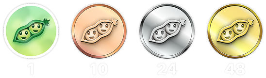
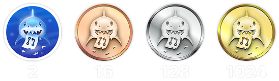

<h1 align="center">
   🏆 GitHubの実績を100%解除する方法 | 2025年版 
   – 速くて誠実なガイド –
</h1>

  <a href="README_UA.md">🇺🇦 Українська</a> &nbsp;|&nbsp;
  <a href="README_ES.md">🇪🇸 Español</a> &nbsp;|&nbsp;
  <a href="README_FR.md">🇫🇷 Français</a> &nbsp;|&nbsp;
  <a href="README_DE.md">🇩🇪 Deutsch</a> &nbsp;|&nbsp;
  <a href="README_ZH.md">🇨🇳 中文</a> &nbsp;|&nbsp;
  <a href="README_HI.md">🇮🇳 हिन्दी</a> &nbsp;|&nbsp;
  <a href="README_AR.md">🇸🇦 العربية</a> &nbsp;|&nbsp;
  <a href="README_PT.md">🇵🇹 Português</a> &nbsp;|&nbsp;
  <a href="README_BN.md">🇧🇩 বাংলা</a> &nbsp;|&nbsp;
  <a href="README_UR.md">🇵🇰 اردو</a> &nbsp;|&nbsp;
  <a href="README_JP.md">🇯🇵 日本語</a> &nbsp;|&nbsp;
  <a href="README_KO.md">🇰🇷 한국어</a>

<h3 align="center">
   メインの問題 
   企業用GitHub ≠ 個人用GitHub
</h3>

これはGitHubの実績に関する最も大きな問題の一つです：

> 多くのプロの開発者は、企業のGitHubアカウントで作業しています。

つまり、次のようなことが起きます：
- すべてのコミット、プルリクエスト、レビューが **別の組織アカウント** に記録される
- あなたの **個人GitHubプロフィールは空のまま**
- 実績？まったく解除されません。

これはあなたのせいではありません — プライベートリポジトリの権限、可視性、アクセス構造によるものです。

> 💡 **ハック**  
> 場合によっては、企業と交渉して個人のGitHubアカウントからコントリビュートする許可を得ることも可能です。  
> それが許されているなら — ラッキーです。ほとんどの開発者にはその特権がありません。

<h3 align="center">ダーティな戦略</h3>

🚫 <b>不正について話そう（そしてなぜそれが愚かか）</b>

はい — GitHubの実績を稼ぐためのいかがわしい手法が存在します：偽のIssue、偽のPR、スパム的なディスカッション、自作自演のスター、幽霊アカウント…なんでもあり。

> ⚠️ このガイドは <code>倫理的で、正直、かつ非トキシックな戦略</code> に100%フォーカスしています。  
> ここにあるすべては、実際の活動とコミュニティへの本当の貢献を反映しています。

覚えておいてください：
- 実績とコントリビューション履歴は <code>公開</code> されています
- 誰でも — 採用担当者、開発者、同僚 — 閲覧できます
- 偽装された活動はすぐにバレます。そして恥ずかしいものです。

実績は <strong>あなたの本当のスキルと価値</strong> を示すものであるべきです。  
システムをだます能力を示すものではありません。

> 💬 <strong>私はチーターを雇うことはありません。</strong> 
> チートが「悪い」からではなく、スマートで正当な戦略があるのにチートを選ぶのは…単なる愚行だからです。

<h3 align="center">正しい方法で実績を稼ぐには</h3>

実績を伸ばすための本当のエンジンについて語りましょう：

> GitHubの実績を最速かつ誠実に獲得する方法は、  
> あなたの個人アカウントで意味のある作業を行うことです —  
> できれば <code>自分自身のオープンソースプロジェクト</code> で。

そして、それは世界を変えるものである必要はありません。

🎯 たとえばこんなものでも構いません：
- 友達と一緒に作っている履歴書テンプレート
- 職場で使用しているユーティリティの小さなライブラリ
- 学習内容をMarkdownでまとめたノート
- いつか欲しかった設定用スターターや小さなツール

💡 ポイントは、実際に役立つものを作り、継続的に作業を進めることです：
* 頻繁にコミットする
* プルリクエストを作成する
* ディスカッションを始める
* 少しずつ改善する

小さなプロジェクトでも、あなたの成長エンジンになります。

> ⚠️ セキュリティは重要 ⚠️  
> <code>セキュアなリポジトリ = 持続可能なリポジトリ</code>。あなたの作業を守りましょう：
> * 明確なアクセスルールを設定する
> * 信頼できるコラボレーターのみにマージやプッシュを許可する
> * スパムや有害なコードからリポジトリを清潔に保つ

<h3 align="center">実績の表示方法を理解することの重要性</h3>

🧠 <b>実績を狙う前に — これを読んで！</b>

多くの人（私も含めて）が、これを少し遅れてから気づきます：

> GitHubの実績は、あなたが行ったアクションの正確な数を表示しません。  
> 表示されるのは <strong>現在のランク</strong> だけです。

たとえば、こう表示されていたら：

<h2 align="center">実績</h2>

    
<b>QUICK DRAW</b>

<blockquote>IssueまたはPRを作成してから5分以内にクローズする。</blockquote>

    

正直に言うと — これは実績というよりミームに近いです 😅  
とても簡単に獲得できるので、あまり価値がないかもしれません…でも、プロフィールに表示されるバッジには変わりありません！

<ol>
    <li>Pull Request を作成する</li>
    <li>すぐにクローズする</li>
</ol>

<blockquote>
   <b>⚠️ ダミーPRを作成する必要はありません。⚠️</b> 
   通常の作業中に任意の実PRを一度クローズして再オープンするだけでもカウントされます。
</blockquote>

    
<b>GALAXY BRAIN</b>

<blockquote>GitHub Discussion において、あなたの返信が「承認された回答」にマークされる。</blockquote>

    

Galaxy Brain は、<strong>本当に役立つ回答</strong>を Discussions に投稿した人に与えられる実績です。  
トピックの作成者があなたの返信を「承認済み」とマークすれば、バッジが手に入ります。

この実績は、自分のオープンソースリポジトリ内でも獲得可能です。  
正当であるだけでなく、<strong>チームにとっても有益な実践</strong>です。

次のようなスキルが身につきます：
<ul>
    <li>構造化され、見つけやすいコミュニケーションの維持</li>
    <li>重要なプロジェクト決定の明確な記録の保存</li>
    <li>チーム全体の認識と議論の同期</li>
</ul>

🚀 ヒューストン、問題発生！ 🚀  
たとえあなたの回答が的確であっても、多くの場合「承認済み」にはされません。  
リマインドしても無視されることが多く、ゴーストされてしまいます。つらいけど現実です。

だからこそ、他人に頼るのではなく、次のような方法を試してみましょう：
> **コントロールされた環境でGalaxy Brainを狙おう：**
* 友人や同僚と協力する
* 実際の質問に答える
* 助けになったら「承認された回答」にマークしてもらう

`🧩 ストラテジー1: 友達の問題を解決する`

<ol>
    <li>自分の技術スタックに関連する公開リポジトリを探す</li>
    <li>Discussions が有効になっているか確認する</li>
    <li>知り合いから技術的な質問があったら、それに答える</li>
    <li>その後、以下を実行する：
         <ul>
            <li>友達に、あなたが用意した要約でDiscussionを作成してもらう</li>
            <li>あなたがそこに回答を投稿する</li>
            <li>その回答を「承認された回答」としてマークしてもらう</li>
         </ul>
    </li>
</ol>

✅ この戦略は誠実かつ有益で、コミュニティにとっても長く使えるリソースになります。

`🛠️ ストラテジー2: 自分のリポジトリでDiscussionsを使う`

自分のオープンソースプロジェクトを管理しているなら、<code>重要な会話をGitHub Discussionsに移行</code>しましょう。

1. リポジトリ設定でDiscussionsを有効化
2. 機能や設計に関する議論があれば、パブリックスレッドを立てる
3. 判断に役立つ、明確かつ建設的な回答を書く
4. 他の人がスレッドを立てた場合は、その人に承認マークを付けてもらえる

✅ この戦略は：
- 決定プロセスの透明性を確保する
- リーダーシップと主体性を示す
- チーム全体の意識を揃える
- そしてもちろん、バッジを獲得できる！

    
<b>YOLO</b>

<blockquote>レビューなしで Pull Request をマージする。</blockquote>

    

このバッジはスピードと信頼、あるいは無謀さ 😅 の象徴です。  
1 回だけで達成できます。

<ol>
    <li>プロジェクトに小さくて安全な変更を加えましょう。例：</li>
    <ul>
        <li>Lint 修正</li>
        <li>ワンライナーのパッチ</li>
        <li><code>README.md</code> へのちょっとした追加</li>
        <li><code>git init</code> を含む初期コミット</li>
    </ul>
    <li>Pull Request を作成</li>
    <li>レビューを待たずに自分でマージ</li>
</ol>

<blockquote>
⚠️ <b>注意：本番環境での YOLO は避けましょう</b> ⚠️ 
オープンソースプロジェクトの初期コミットをマージすれば、クリーンで合法的です 😉
</blockquote>

    
<b>PAIR EXTRAORDINAIRE</b>

<blockquote>共同執筆者のコミットを含む PR をマージする。</blockquote>

    

一緒にコーディングすれば、成果もバッジもより良いものになります！  
このバッジを獲得するには、ペアプログラミングを実践しましょう。

<ol>
    <li>チームメイトと一緒にアイデアを出し合いながらコードを書く</li>
    <li>コミットメッセージに以下を追加： 
        <code>Co-authored-by: ユーザー名 &lt;メールアドレス&gt;</code>
    </li>
    <li>PR を作成してマージ</li>
</ol>

✅ Pull Shark との同時達成も可能！効率よくバッジをゲットしましょう！

    
<b>SPONSOR</b>

<blockquote>🐺 ウィッチャーにコインを投げよう</blockquote>

    

GitHub Sponsors を通じて、オープンソース開発者またはプロジェクトを金銭的に支援しましょう。

    
   このバッジを獲得するには、オープンソースの取り組みに寄付するだけです。 
   毎日使っているツールかもしれません。 
   週末を救ってくれたリポジトリかもしれません。 
   あるいは、純粋に尊敬している開発者でも良いでしょう。 
    

💡 たとえ少額でも、寄付は大きな意味を持ちます。  
それは感謝と敬意の表れであり、オープンソースの精神を支える行動です。

> ❤️ このガイドが役に立ったなら、ぜひこのリポジトリを `スポンサー` してください。  
> 労力への「ありがとう」を伝える最良の方法です。

    
<b>PULL SHARK</b>

<blockquote>あなたのPRが他の誰かによってマージされる。</blockquote>

    

最も簡単な始め方は、自分自身のオープンソースプロジェクトで作業することです（前述しましたね）。  
実際に価値あるPRを作成し、コラボレーターにレビューとマージを依頼しましょう。

⭐ これは GitHub 上で最も<strong>スキルを高めてくれる実績</strong>です。  
読みやすく、テストしやすく、レビューしやすいコードを書く力を育ててくれます。

> 💡 **ハック 0: 小さくて独立したPRを作成する**  
初心者はよく「巨大なPR」罠に陥ります。  
すべてを1つの大きなPRに詰め込んでしまうのです。  
でもPull Sharkを正しく獲得し、開発者として成長するためには、<code>スコープが明確で、読みやすく、テスト可能な小さなPR</code>を作るスキルが必要です。  
これは単なるバッジのためではなく、<strong>プロの開発者の基本</strong>です。

> 🤝 **ハック 1: “Pair Extraordinaire” も同時に進めよう**  
> コラボレーターとペアを組み、一緒にコードを書いたりレビューしたりしよう。  
> 共同作業であることを示すために <code>Co-authored-by:</code> を使えば、  
> 2つの実績を同時に進行できます。効率的！

> 🎯 **ハック 2: YOLOを譲ろう**  
> 小さくて安全なPRを作ったら、  
> あなたの仲間に<em>レビューなしで</em>マージさせて、YOLOバッジを取らせてあげよう。  
> あなたは価値を提供し、相手は実績を得る。<code>Win-Win</code>です！

    
<b>STARSTRUCK</b>

<blockquote>多くのスターを獲得したリポジトリを作成する。</blockquote>

    

これは GitHub 上でもっとも困難かつ尊敬される実績の一つです。  
コミュニティへの影響力を示しており、ルーチン作業では得られません。  
採用担当者や開発者はこれを真剣に見ています。

この実績にはチェックリストも近道もありません。  
本当にコミュニティが抱えている問題を特定し、それを解決することが唯一の道です。

🎯 現実的には、以下の2つの方法があります：

<ol>
    <li><strong>ソフトウェアプロダクトを作る</strong> 
        正直なところ、これは優れたスキルと数年の経験が必要です。  
        最初のリポジトリには難しいかもしれません。
    </li>
    <li><strong>役立つリソースとして価値あるリポジトリを作る</strong> 
        例：よく書かれたガイド、有用な設定スターター、小さなCLIツール、またはキュレーションされたツール一覧（awesome list）。
    </li>
</ol>

<blockquote><strong>⭐ 「Star」ボタンを押してくれ、ブラザー！ ⭐</strong> 
このリポジトリはコミュニティのために作られた良いリソースの例です。  
もしこのガイドが役に立ったなら、ぜひスターをお願いします 🫡
</blockquote>

---

### 🧠 あなた自身の「スターに値するアイデア」を見つけるには？

痛み（ペイン）に注目しましょう。問題を見つける力を養ってください。以下をチェック：

1. **Googleのオートコンプリート** — 人々が検索している内容を見る：  
   `"github how to..."`, `"vite storybook setup..."` など。

2. **お気に入りのフレームワークの Issues & Discussions**  
   何かを求める投稿に多くの 👍 がついていれば、それは実際のニーズです。

3. **フラストレーションに耳を傾けよう** — あなたや他人がこう言う時：  
   *「これ本当にイライラする！」* や *「こんなのがあればいいのに…」* — それがヒントです。

その後はシンプルです：**解決策を提供しましょう**。  
それをクリーンなリポジトリにまとめ、明確なREADMEを用意して、シェアするだけです。

