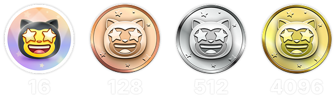

<h1 align="center">
   🏆 如何在 2025 年解锁 100% 的 GitHub 成就 
   – 快速且诚实的指南 –
</h1>

  <a href="README_UA.md">🇺🇦 Українська</a> &nbsp;|&nbsp;
  <a href="../README.md">🇬🇧 English</a> &nbsp;|&nbsp;
  <a href="README_ES.md">🇪🇸 Español</a> &nbsp;|&nbsp;
  <a href="README_FR.md">🇫🇷 Français</a> &nbsp;|&nbsp;
  <a href="README_DE.md">🇩🇪 Deutsch</a> &nbsp;|&nbsp;
  <a href="README_HI.md">🇮🇳 हिन्दी</a> &nbsp;|&nbsp;
  <a href="README_AR.md">🇸🇦 العربية</a> &nbsp;|&nbsp;
  <a href="README_PT.md">🇵🇹 Português</a> &nbsp;|&nbsp;
  <a href="README_BN.md">🇧🇩 বাংলা</a> &nbsp;|&nbsp;
  <a href="README_UR.md">🇵🇰 اردو</a> &nbsp;|&nbsp;
  <a href="README_JP.md">🇯🇵 日本語</a> &nbsp;|&nbsp;
  <a href="README_KO.md">🇰🇷 한국어</a>

<h3 align="center">
   主要问题 
   公司 GitHub ≠ 个人 GitHub
</h3>

这是 GitHub 成就系统中最大的一个问题之一：

> 大多数专业开发者都是使用公司的 GitHub 账户工作的。

这意味着：
- 你所有的 commit、pull request 和 review 都记录在**公司组织账户**中
- 你的**个人 GitHub 主页看起来毫无贡献**
- 而你的成就？根本无法解锁

这不是你的错 —— 这是私有仓库权限、可见性和访问机制的限制。

> 💡 **小贴士**  
> 有时候你可以与公司沟通，争取使用你的**个人 GitHub 账号**进行贡献。  
> 如果你有这样的机会 —— 恭喜你，真的很幸运。大部分人没有这待遇。

<h3 align="center">肮脏的策略</h3>

🚫 <b>我们来谈谈作弊（以及它有多蠢）</b>

是的 —— 有一些黑操作可以“刷” GitHub 成就：伪造 issues、PR，水帖讨论、自赞、僵尸账号……你能想到的都有。

> ⚠️ 本指南完全专注于<code>道德、诚实、非恶意的策略</code>。  
> 所有方法都基于真实贡献，真实活动，服务于开源社区。

请记住：
- 成就与贡献历史是<code>公开的</code>
- 任何人 —— 招聘者、开发者、你的同事 —— 都能看到
- 虚假行为非常显眼，令人尴尬

成就应该代表<strong>你的真实能力和价值</strong>，而不是你有多会“钻空子”。

> 💬 <strong>我绝不会雇佣一个作弊者。</strong> 
> 不是因为“作弊”这件事本身有多坏，而是因为当有更聪明、更正当的方式可选时你还选择作弊……那只能说你太蠢了。

<h3 align="center">如何正确地解锁成就</h3>

我们来聊聊真正推动你解锁成就的“引擎”：

> 解锁 GitHub 成就最快、最正当的方法 ——  
> 就是在你自己的 GitHub 账号下做些有意义的事，  
> 最好是在一个<code>你自己的开源项目中</code>。

不需要是惊天动地的大项目。

🎯 它可以是：
- 你和朋友一起维护的简历模板
- 一套你在工作中常用的小工具库
- 用 Markdown 写下你正在学习的内容
- 一个配置模板或你一直想做的小工具

💡 关键在于：**创建一些真实的内容，并持续迭代改进**：
* 经常 commit
* 提交 Pull Request
* 发起讨论
* 一步步优化完善

即使是非常小的项目，也可以成为你成长的加速器。

> ⚠️ 安全非常重要 ⚠️  
> <code>安全的仓库 = 可持续的仓库</code>。保护好你的项目：
> * 明确设置访问权限
> * 确保只有信任的合作者可以 push 或 merge
> * 防止垃圾内容和恶意代码污染你的代码库

<h3 align="center">为什么理解成就的展示方式很重要</h3>

🧠 <b>在你开始之前，请务必读这段！</b>

很多人（包括我自己）都在很晚才意识到一件事：

> GitHub 成就并不会展示你做了多少操作，  
> 它只会显示你当前所在的<strong>成就等级</strong>。

例如你看到：

> <code>Pull Shark x2</code>  
> 这并不是说你合并了两个 PR。  
> 它表示你达到了第二等级（比如合并了 32 个 PR）。

💡 所以没必要惊慌、也别急着造假 PR 来“测试它是不是在工作”。

<h2 align="center">成就一览</h2>

    
<b>QUICK DRAW</b>

<blockquote>在创建 Issue 或 PR 后 5 分钟内关闭它。</blockquote>

    

说实话 —— 这个成就更像是个表情包而不是里程碑 😅  
太容易拿了，几乎没啥挑战… 但嘿，放在你的个人资料上还是很好看！

<ol>
    <li>创建一个 Pull Request</li>
    <li>立即将其关闭</li>
</ol>

<blockquote>
   <b>⚠️ 不需要创建假 PR。⚠️</b> 
   正常工作中随便关闭并重新打开一个真实 PR 也会被计入哦。
</blockquote>

    
<b>GALAXY BRAIN</b>

<blockquote>你的回答在 GitHub Discussion 中被标记为“已采纳答案”。</blockquote>

    

Galaxy Brain 是为了奖励那些在讨论中给出<strong>真正有帮助的回答</strong>的人。  
如果你的回答被发帖人标记为“已采纳” —— 恭喜，成就是你的了！

你完全可以在自己的开源仓库中刷这个成就，  
而且这不仅是合法的方式 —— 还是一种<strong>对团队极有价值的实践</strong>。

你将学会如何：
<ul>
    <li>组织清晰、可追溯的沟通</li>
    <li>将关键决策变成永久可查的记录</li>
    <li>让整个团队保持同步与透明</li>
</ul>

🚀 但也有一个现实问题 🚀  
即使你的回答真的很棒并解决了问题 ——  
很多人并不会去点击“采纳为答案”。你提醒他也可能会被无视，甚至被 ghost。  
残酷但真实。

所以，不要依赖陌生人。试试这个方法：
> 在<strong>可控环境</strong>中刷 Galaxy Brain：
* 跟朋友或同事合作
* 回答他们真实的问题
* 如果答案真的帮上忙，请他们标记为“已采纳”

`🧩 策略一：帮朋友解决问题`

<ol>
    <li>找到与你技术栈相关的公共仓库</li>
    <li>确认是否启用了 Discussions</li>
    <li>当你的朋友问了你知道答案的问题 —— 帮他解决</li>
    <li>之后按以下步骤操作：
         <ul>
            <li>请朋友用你提供的内容在相关仓库中发起一个 Discussion</li>
            <li>你去那条帖子下回复原来的回答</li>
            <li>请他将你的回答标记为“已采纳”</li>
         </ul>
    </li>
</ol>

✅ 这是一个诚实、互助、可持续的好方法，还能为社区积累宝贵知识。

`🛠️ 策略二：在你自己的仓库中使用 Discussions`

如果你维护一个开源项目，直接把关键沟通<code>搬到 GitHub Discussions</code> 里吧：

1. 在仓库设置中启用 Discussions
2. 有重要的决定或功能讨论时，开一个公共话题
3. 写出清晰、专业、有建设性的回应
4. 如果别人是话题发起人，他们就能将你的回答标记为“已采纳”

✅ 此策略的好处：
- 留下公开透明的决策记录
- 展示你的组织能力与领导力
- 让团队保持一致
- 同时 —— 拿下成就 💪

    
<b>SPONSOR</b>

<blockquote>🐺 向猎魔人扔一枚金币</blockquote>

    

通过 GitHub Sponsors 资助开源开发者或项目。

    
   要获得这个徽章，只需捐赠给任何一个开源项目。 
   也许是你每天使用的工具。 
   也许是曾经拯救你周末的一个仓库。 
   又或者只是一个你真心敬佩的开发者。 
    

💡 即使是微小的捐款，也能产生巨大的意义。  
它代表着认可、尊重，并帮助保持开源的生命力。

> ❤️ 如果这个指南对你有帮助 —— 欢迎 `赞助本仓库`。  
> 这会是你表达“感谢”最真诚的方式。

    
<b>PULL SHARK</b>

<blockquote>你的 Pull Request 被其他人合并。</blockquote>

    

最简单的方式是：从你自己的开源项目开始 —— 我们前面已经提到过了。  
创建真实、有价值的 Pull Request，然后请协作者帮你审查并合并。

⭐ 这是 GitHub 上最能<strong>提升技能</strong>的徽章 —— 它促使你写出干净、可测试、易于 review 的代码。

> 💡 **技巧 0：拆成小而精的 PR**  
很多新手会犯“超级 PR”错误：把所有内容塞进一个巨大的提交。  
如果你想高效解锁 Pull Shark（并成长为专业开发者），你必须学会提交小巧、聚焦的 PR。  
也就是：<code>清晰、易读、易测、易于审查</code>。  
这不只是为了徽章 —— <strong>这是专业开发者的写法</strong>。

> 🤝 **技巧 1：顺便解锁「Pair Extraordinaire」**  
> 找一个协作者进行配对编程。一起写代码、交流反馈、互相 review。  
> 使用 <code>Co-authored-by:</code> 标签标注共同努力。  
> 双人组队，双倍成就！

> 🎯 **技巧 2：把 YOLO 送给队友**  
> 如果你写了一个小而安全的 PR ——  
> 让你的同事<em>不经过审查</em>直接合并它，好让他解锁 YOLO 成就。  
> 你提供价值，他拿到徽章，<code>双赢</code>！

    
<b>STARSTRUCK</b>

<blockquote>创建一个获得大量 Star 的仓库。</blockquote>

    

这是 GitHub 上最难获得、最受尊敬的成就之一。  
它代表着你对社区的真正影响，无法通过机械操作获得。  
招聘者和开发者都会认真看待它。

你无法照着清单或通过捷径解锁这个成就 ——  
你只能识别出社区的<strong>真实痛点</strong>，然后……解决它。

🎯 我认为有两条现实路径：

<ol>
    <li><strong>打造一个软件产品</strong> 
        说实话 —— 这需要顶级能力和数年的经验，才能找对问题。  
        这可能不适合你的第一个仓库。
    </li>
    <li><strong>创建一个真正有用的资源仓库</strong> 
        比如：写得清晰的指南、有用的配置模板、小型 CLI 工具，或者一份精选资源清单（awesome list）。
    </li>
</ol>

<blockquote><strong>⭐ 来吧，点颗星星兄弟 ⭐</strong> 
这个仓库是为社区贡献资源的好例子。  
如果你觉得本指南有帮助 —— 记得点 Star 🫡
</blockquote>

---

### 🧠 如何找到一个值得 Star 的点子？

关注“痛点”。学会发现它们。你可以这样找：

1. **Google 自动补全** —— 看大家都在搜索什么：  
   `"github how to..."`, `"vite storybook setup..."` 等等

2. **你常用框架的 issues 和 discussions**：  
   如果有人发帖 + 获得很多 👍，那就是真实需求。

3. **留意情绪化的吐槽** —— 每当你或别人说：  
   *“这玩意真烦！”* 或 *“要是有这个就好了……”* —— 那就是信号！

之后，事情就变得简单了：**给出解决方案**。  
把它包装进一个干净的仓库，写好 README —— 然后分享出去。

